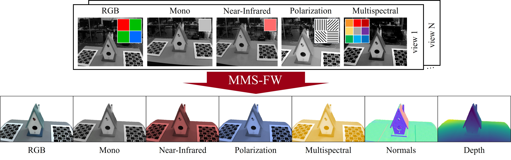

# MultimodalStudio: A Heterogeneous Sensor Dataset and Framework for Neural Rendering across Multiple Imaging Modalities

[Project Page](https://lttm.github.io/MultimodalStudio) | [arXiv](https://arxiv.org/abs/2406.00000) | [Dataset](https://lttm.github.io/MultimodalStudio/pages/dataset.html)

Federico Lincetto<sup>1</sup>, Gianluca Agresti<sup>2</sup>, Mattia Rossi<sup>2</sup>, Pietro Zanuttigh<sup>1</sup>  
<sup>1</sup>University of Padova;  <sup>2</sup>Sony Europe Limited

Accepted at CVPR 2025



## About
Official repository of **MultimodalStudio**, a project that includes **MMS-DATA** and **MMS-FW**. **MMS-DATA** is a geometrically calibrated multi-view multi-sensor dataset; **MMS-FW** is a multimodal NeRF framework that supports mosaicked, demosaicked, distorted, and undistorted frames of different modalities.

We conducted in depth investigations proving that using multiple imaging modalities improves the novel view rendering quality of each involved modality. 

## Installation

### 1. Clone the Repository

```bash
git clone https://github.com/LTTM/MultimodalStudio.git
cd MultimodalStudio
```

### 2. Create the Environment

We suggest using conda-based CLI (e.g. [micromamba](https://mamba.readthedocs.io/en/latest/installation/micromamba-installation.html)) for convenience, as it simplifies the environment setup. However, you can use any other environment manager.

```bash
conda env create -f requirements.yaml
conda activate multimodalstudio
```

### 3. Install tiny-cuda-nn

[tiny-cuda-nn](https://github.com/NVlabs/tiny-cuda-nn) is a fast neural network library developed in C++/CUDA, designed for efficient training and inference of small neural networks and multi-resolution hash encodings, especially in neural graphics and neural rendering applications.

**Requirements:**  
- CUDA toolkit (including the CUDA compiler `nvcc`) must be installed and available in your system.
- The version of the CUDA toolkit must match the version of CUDA installed along with PyTorch during the environment creation.

If you are unsure about your CUDA version, check with:
```bash
nvcc --version
```
and ensure it matches the CUDA version reported by:
```bash
# Activate the correct environment first
python -c "import torch; print(torch.version.cuda)"
```

Install [tiny-cuda-nn](https://github.com/NVlabs/tiny-cuda-nn):

```bash
pip install git+https://github.com/NVlabs/tiny-cuda-nn/#subdirectory=bindings/torch
```

### 4. Move to working directory
The working directory is where the main scripts and configurations are located.
We suggest to add this folder to your `PYTHONPATH` environment variable for easier access to the modules.

```bash
cd ./src
export PYTHONPATH=$(pwd):$PYTHONPATH
```

## Dataset Preparation

You have two options for preparing the dataset:

1. **Download Preprocessed Data**  
   Preprocessed datasets are available on the [Dataset Page](https://lttm.github.io/MultimodalStudio/pages/dataset.html). These datasets are ready to be used for training without any additional steps.

2. **Use a Custom Dataset**  
   If you want to use your own dataset, you need to preprocess it using the provided scripts. The preprocessing step ensures that the dataset is formatted correctly and ready for training.

### Required Folder Organization

The preprocessing script requires a specific folder structure for the input data:

```
<scene_folder>/
    calibration.json
    modalities/
        <modality1>/
            0000.png
            0001.png
            ...
        <modality2>/
            0000.png
            0001.png
            ...
```
- Each modality should have its own subfolder inside `modalities/` containing the corresponding frames.
- The `calibration.json` file must be placed directly inside the `<scene_folder>`.

### Calibration File Format

The `calibration.json` file must follow this structure:

```json
{
    "modality1": {
        "sensor": "<sensor_name>",
        "width": <image_width>,
        "height": <image_height>,
        "fx": <focal_length_x>,
        "fy": <focal_length_y>,
        "cx": <principal_point_x>,
        "cy": <principal_point_y>,
        "distortion_params": [
            <k1>, <k2>, <p1>, <p2>, <k3>, <k4>
        ],
        "mosaick_pattern": [
            [<pattern_row_1>],
            [<pattern_row_2>]
        ],
        "camera2reference": [
            [<r11>, <r12>, <r13>, <t1>],
            [<r21>, <r22>, <r23>, <t2>],
            [<r31>, <r32>, <r33>, <t3>],
            [0.0, 0.0, 0.0, 1.0]
        ]
    },
    ...additional modalities...
}
```

- Each modality (e.g., `modality1`, `modality2`) must have its own entry.
- Key parameters include:
  - `fx`, `fy`: Focal lengths in pixels.
  - `cx`, `cy`: Principal points in pixels.
  - `distortion_params`: Radial and tangential distortion coefficients.
  - `mosaick_pattern`: The mosaick pattern for the modality.
  - `camera2reference`: Transformation matrix from the camera coordinate system to the reference modality camera coordinate system. In example, if the reference modality is the RGB, then all the other modalities have a camera2reference transofrmation matrix to map their coordinate system to the RGB coordinate system. The reference modality is the first one listed in the `modalities` argument during preprocessing. Its frames are used to compute the camera poses with COLMAP.

### Preprocessing Commands

These scripts will preprocess your dataset, preparing the data for training.

#### For custom datasets:
  ```bash
  python src/preprocessing/preprocess_custom_dataset.py \
    --source-path <scene_folder> \
    --output-path <output_path> \
    --colmap-path <colmap_path> \
    --modalities <modality1> <modality2> ... \
    --run-colmap \
    --calibration <scene_folder>/calibration.json \
    --scale 1.0 \
    --undistort \
    --demosaick \
    --raw-input
  ```
  For more details on the arguments, run:
  ```bash
    python src/preprocessing/preprocess_custom_dataset.py --help
  ```

#### For MMS-DATA dataset:

In the case you want to preprocess the MMS-DATA dataset, first you can download the "Source Data" version from the [Dataset Page](https://lttm.github.io/MultimodalStudio/pages/dataset.html), then use the provided preprocessing script specific for MMS-DATA.
  
  ```bash
  python src/preprocessing/preprocess_mmsdata.py \
    --source-path <scene_folder> \
    --output-path <output_path> \
    --colmap-path <colmap_path> \
    --modalities rgb infrared mono polarization multispectral \
    --run-colmap \
    --calibration <scene_folder>/calibration.json \
    --scale 1.0 \
    --undistort \
    --demosaick
  ```

Adjust the arguments according to your needs.

## Run Training or Evaluation

The main launcher script is:

```bash
python src/launcher.py \
    --mode <train_or_eval> \
    --conf_path <path_to_config_file> \
    --scene <path_to_preprocessed_scene_folder> \
    --version <experiment_version_name>
```

### Arguments:
- `--mode`: Specify the mode of operation, either `train` or `eval`.
- `--conf_path`: Path to the configuration file (e.g., `confs/grid_raw.yaml`).
- `--scene`: Path to the processed scene folder.
- `--version`: (Optional) A name or identifier for the experiment version.
- `--view_ids`: (Optional, use with --mode=eval) Specify the view indices to evaluate the model on during evaluation. If nor provided, the script will evaluate all the views specified in the `confs/<config_file>.yaml` passed to `--conf_path`.

Example:
```bash
python src/launcher.py \
    --mode train \
    --conf_path confs/grid_raw.yaml \
    --scene /path/to/processed/dataset/scene_name \
    --version my_first_test
```

Configure your experiment by editing the configuration file in `./confs/<config_file>.yaml`.
For more information on how to edit the configuration files and use the modularity features, check the guide in the `docs` folder (see `docs/modularity_documentation.md`).

## Compute Metrics

To evaluate the quality of rendered frames, use:

```bash
python scripts/evaluate_average_metrics.py
```

Edit the script to set the correct paths for:
- `general_path` (training output folder)
- `consistent_mask_path` (mask output folder)
- `source_data_path` (ground truth data)

The script will compute PSNR, SSIM, and LPIPS metrics for each modality and print average results.

## Reproducing Paper Results

To reproduce the results reported in the MultimodalStudio paper, you can train the framework on all the scenes employing the method configurations provided in `src/configs/method_configs.py`, the config files in `confs/`, and using the data provided in the [Dataset page](https://lttm.github.io/MultimodalStudio/pages/dataset.html).

Below we report the average PSNR and SSIM metrics (over all scenes) for a 5-modality training, obtained by training with raw frames and multiresolution hash grid models:

| Modality      | PSNR (↑) | SSIM (↑) |
|---------------|----------|----------|
| RGB           | 32.45    | -        |
| Mono          | 32.75    | 0.94     |
| NIR           | 34.06    | 0.93     |
| Polarization  | 30.91    | -        |
| Multispectral | 31.27    | -        |

**Note:**  
These results are slightly better than those reported in the paper. This is because, for these experiments, we used an MLP to estimate the background instead of a multiresolution hash grid (to save memory space), and we employed slightly deeper modality heads. All other settings match the original paper.

---

For more details, refer to the comments in each script and the documentation in the repository.

## Citation

If you use this code or dataset, please cite:

```bibtex
@inproceedings{lincetto2025multimodalstudio,
  author    = {Lincetto, Federico and Agresti, Gianluca and Rossi, Mattia and Zanuttigh, Pietro},
  title     = {MultimodalStudio: A Heterogeneous Sensor Dataset and Framework for Neural Rendering across Multiple Imaging Modalities},
  booktitle = {Proceedings of the IEEE/CVF Conference on Computer Vision and Pattern Recognition},
  year      = {2025},
}
```

## Acknowledgments

This project was funded by Sony Eurpoe Limited.


This project was inspired by [NeRFStudio](https://nerf.studio/) and [SDFStudio](https://github.com/autonomousvision/sdfstudio).  
Moreover, [tiny-cuda-nn](https://github.com/NVlabs/tiny-cuda-nn) and [polanalyser](https://github.com/elerac/polanalyser) are used in this project.  
We thank their authors for their contributions to the field and for providing excellent resources for the community.
