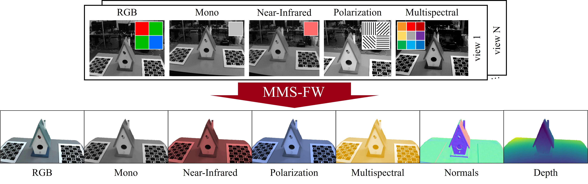
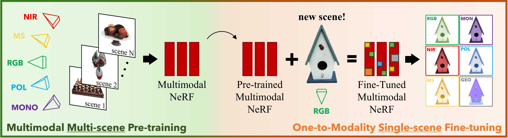

# MultimodalStudio

Official repository of two projects on neural rendering across multiple imaging modalities. They share
the same framework, environment and dataset, and differ in the configurations and in the training
procedure they use.

## Table of Contents

- [MultimodalStudio (CVPR 2025)](#multimodalstudio-a-heterogeneous-sensor-dataset-and-framework-for-neural-rendering-across-multiple-imaging-modalities)
- [SPoILeR (ECCV 2026)](#learning-spectral-and-polarimetric-clues-for-one-to-multimodal-novel-view-synthesis)
- [Installation](#installation)
- [Dataset Preparation](#dataset-preparation)
- [Run Training or Evaluation](#run-training-or-evaluation)
- [Training SPoILeR](#training-spoiler)
- [Compute Metrics](#compute-metrics)
- [Reproducing Paper Results](#reproducing-paper-results)
- [Citation](#citation)
- [Acknowledgments](#acknowledgments)

## MultimodalStudio: A Heterogeneous Sensor Dataset and Framework for Neural Rendering across Multiple Imaging Modalities

[Project Page](https://lttm.github.io/MultimodalStudio) | [arXiv](https://arxiv.org/abs/2406.00000) | [Dataset](https://lttm.github.io/MultimodalStudio/pages/dataset.html)

Federico Lincetto<sup>1</sup>, Gianluca Agresti<sup>2</sup>, Mattia Rossi<sup>2</sup>, Pietro Zanuttigh<sup>1</sup>  
<sup>1</sup>University of Padova;  <sup>2</sup>Sony Europe Limited

Accepted at **CVPR 2025**



**MultimodalStudio** includes **MMS-DATA** and **MMS-FW**. **MMS-DATA** is a geometrically calibrated multi-view multi-sensor dataset; **MMS-FW** is a multimodal NeRF framework that supports mosaicked, demosaicked, distorted, and undistorted frames of different modalities.

We conducted in depth investigations proving that using multiple imaging modalities improves the novel view rendering quality of each involved modality.

## Learning Spectral and Polarimetric Clues for One-to-Multimodal Novel View Synthesis

[Project Page](https://lttm.github.io/MultimodalStudio/pages/SPoILeR.html) | [arXiv](https://arxiv.org/abs/2607.02372) | [Video](https://www.youtube.com/watch?v=6kGtjk4jHC8)

Federico Lincetto<sup>1</sup>, Gianluca Agresti<sup>2</sup>, Mattia Rossi<sup>2</sup>, Piergiorgio Sartor<sup>2</sup>, Pietro Zanuttigh<sup>1</sup>  
<sup>1</sup>University of Padova;  <sup>2</sup>Sony Europe Limited

Accepted at **ECCV 2026**



We present **SPoILeR**, a multimodal NeRF-based method that renders multi-view consistent Near-Infrared, Monochrome, Polarization, and Multispectral views of a scene captured with RGB cameras alone. A multi-scene multimodal pre-training phase lets the model learn the mutual correlation between imaging modalities; a lightweight per-scene fine-tuning phase, supervised only by RGB frames, then recovers photorealistic and multi-view consistent renderings of the modalities that were never captured for that scene.

## Installation

### 1. Clone the Repository

```bash
git clone https://github.com/LTTM/MultimodalStudio.git
cd MultimodalStudio
```

### 2. Create the Environment

We suggest using conda-based CLI (e.g. [micromamba](https://mamba.readthedocs.io/en/latest/installation/micromamba-installation.html)) for convenience, as it simplifies the environment setup. However, you can use any other environment manager.

```bash
conda env create -f requirements.yaml
conda activate multimodalstudio
```

### 3. Install tiny-cuda-nn

[tiny-cuda-nn](https://github.com/NVlabs/tiny-cuda-nn) is a fast neural network library developed in C++/CUDA, designed for efficient training and inference of small neural networks and multi-resolution hash encodings, especially in neural graphics and neural rendering applications.

**Requirements:**  
- CUDA toolkit (including the CUDA compiler `nvcc`) must be installed and available in your system.
- The version of the CUDA toolkit must match the version of CUDA installed along with PyTorch during the environment creation.

If you are unsure about your CUDA version, check with:
```bash
nvcc --version
```
and ensure it matches the CUDA version reported by:
```bash
# Activate the correct environment first
python -c "import torch; print(torch.version.cuda)"
```

Install [tiny-cuda-nn](https://github.com/NVlabs/tiny-cuda-nn):

```bash
pip install git+https://github.com/NVlabs/tiny-cuda-nn/#subdirectory=bindings/torch
```

### 4. Move to working directory
The working directory is where the main scripts and configurations are located.
We suggest to add this folder to your `PYTHONPATH` environment variable for easier access to the modules.

```bash
cd ./src
export PYTHONPATH=$(pwd):$PYTHONPATH
```

## Dataset Preparation

You have two options for preparing the dataset:

1. **Download Preprocessed Data**  
   Preprocessed datasets are available on the [Dataset Page](https://lttm.github.io/MultimodalStudio/pages/dataset.html). These datasets are ready to be used for training without any additional steps.

2. **Use a Custom Dataset**  
   If you want to use your own dataset, you need to preprocess it using the provided scripts. The preprocessing step ensures that the dataset is formatted correctly and ready for training.

### Required Folder Organization

The preprocessing script requires a specific folder structure for the input data:

```
<scene_folder>/
    calibration.json
    modalities/
        <modality1>/
            0000.png
            0001.png
            ...
        <modality2>/
            0000.png
            0001.png
            ...
```
- Each modality should have its own subfolder inside `modalities/` containing the corresponding frames.
- The `calibration.json` file must be placed directly inside the `<scene_folder>`.

### Calibration File Format

The `calibration.json` file must follow this structure:

```json
{
    "modality1": {
        "sensor": "<sensor_name>",
        "width": <image_width>,
        "height": <image_height>,
        "fx": <focal_length_x>,
        "fy": <focal_length_y>,
        "cx": <principal_point_x>,
        "cy": <principal_point_y>,
        "distortion_params": [
            <k1>, <k2>, <p1>, <p2>, <k3>, <k4>
        ],
        "mosaick_pattern": [
            [<pattern_row_1>],
            [<pattern_row_2>]
        ],
        "camera2reference": [
            [<r11>, <r12>, <r13>, <t1>],
            [<r21>, <r22>, <r23>, <t2>],
            [<r31>, <r32>, <r33>, <t3>],
            [0.0, 0.0, 0.0, 1.0]
        ]
    },
    ...additional modalities...
}
```

- Each modality (e.g., `modality1`, `modality2`) must have its own entry.
- Key parameters include:
  - `fx`, `fy`: Focal lengths in pixels.
  - `cx`, `cy`: Principal points in pixels.
  - `distortion_params`: Radial and tangential distortion coefficients.
  - `mosaick_pattern`: The mosaick pattern for the modality.
  - `camera2reference`: Transformation matrix from the camera coordinate system to the reference modality camera coordinate system. In example, if the reference modality is the RGB, then all the other modalities have a camera2reference transofrmation matrix to map their coordinate system to the RGB coordinate system. The reference modality is the first one listed in the `modalities` argument during preprocessing. Its frames are used to compute the camera poses with COLMAP.

### Preprocessing Commands

These scripts will preprocess your dataset, preparing the data for training.

#### For custom datasets:
  ```bash
  python src/preprocessing/preprocess_custom_dataset.py \
    --source-path <scene_folder> \
    --output-path <output_path> \
    --colmap-path <colmap_path> \
    --modalities <modality1> <modality2> ... \
    --run-colmap \
    --calibration <scene_folder>/calibration.json \
    --scale 1.0 \
    --undistort \
    --demosaick \
    --raw-input
  ```
  For more details on the arguments, run:
  ```bash
    python src/preprocessing/preprocess_custom_dataset.py --help
  ```

#### For MMS-DATA dataset:

In the case you want to preprocess the MMS-DATA dataset, first you can download the "Source Data" version from the [Dataset Page](https://lttm.github.io/MultimodalStudio/pages/dataset.html), then use the provided preprocessing script specific for MMS-DATA.
  
  ```bash
  python src/preprocessing/preprocess_mmsdata.py \
    --source-path <scene_folder> \
    --output-path <output_path> \
    --colmap-path <colmap_path> \
    --modalities rgb infrared mono polarization multispectral \
    --run-colmap \
    --calibration <scene_folder>/calibration.json \
    --scale 1.0 \
    --undistort \
    --demosaick
  ```

Adjust the arguments according to your needs.

## Run Training or Evaluation

The main launcher script is:

```bash
python src/launcher.py \
    --mode <train_or_eval> \
    --conf_path <path_to_config_file> \
    --scene <path_to_preprocessed_scene_folder> \
    --version <experiment_version_name>
```

### Arguments:
- `--mode`: Specify the mode of operation, either `train` or `eval`.
- `--conf_path`: Path to the configuration file (e.g., `confs/multimodalstudio/grid_raw.yaml`).
- `--scene`: Path to the processed scene folder.
- `--version`: (Optional) A name or identifier for the experiment version.
- `--view_ids`: (Optional, use with --mode=eval) Specify the view indices to evaluate the model on during evaluation. If nor provided, the script will evaluate all the views specified in the `confs/<subfolder>/<config_file>.yaml` passed to `--conf_path`.

Example:
```bash
python src/launcher.py \
    --mode train \
    --conf_path confs/multimodalstudio/grid_raw.yaml \
    --scene /path/to/processed/dataset/scene_name \
    --version my_first_test
```

Configure your experiment by editing the configuration file in `./confs/<subfolder>/<config_file>.yaml`. The configurations of MultimodalStudio are in `./confs/multimodalstudio/`, the ones of SPoILeR in `./confs/spoiler/`.
`./confs/template.yaml` is a fully commented template listing the available options; use it as a reference when writing your own configuration.
For more information on how to edit the configuration files and use the modularity features, check the guide in the `docs` folder (see `docs/modularity_documentation.md`).

## Training SPoILeR

SPoILeR is trained in two stages: a **pre-training** shared across many scenes, followed by a
**fine-tuning** on each target scene. Both stages use the same launcher and differ only in the
configuration file.

### 1. Pre-training

Pre-training runs on several scenes at once, so `--scene` must point at the folder *containing*
the preprocessed scenes, not at a single scene:

```bash
python src/launcher.py \
    --mode train \
    --conf_path confs/spoiler/spoiler_pretraining.yaml \
    --scene /path/to/processed/dataset/scenes \
    --version v0
```

The data manager cycles through the scenes, switching every `pipeline.steps_per_scene` iterations.
The scenes listed in `pipeline.datamanager.eval_scene_indices` are held out and never used for
training. The modules that are scene-specific are replicated once per scene, while the remaining
parameters are shared: this is what the fine-tuning stage later reuses.

### 2. Fine-tuning

Fine-tuning adapts the pre-trained model to a single scene:

```bash
python src/launcher.py \
    --mode train \
    --conf_path confs/spoiler/spoiler_ft_rgb_nir.yaml \
    --scene /path/to/processed/dataset/scenes/<scene_name> \
    --version v0
```

The fine-tuning configurations locate the pre-trained model through `pipeline.pretrained_model_path`:

```yaml
pipeline:
  pretrained_model_path: './output/main/scenes/multiscene_dictionary_fields_raw_model_radiance_latent/spoiler_pretraining/v0/checkpoints'
```

Since checkpoints are written to
`output/<git_branch>/<scene_folder_name>/<method_name>/<conf_name>/<version>/checkpoints`,
**this path must be adapted to the run produced by step 1** — in particular the branch name and the
`--version` you passed. With `pipeline.average_multi_modules: True` the per-scene replicas stored in
the pre-training checkpoint are averaged into a single instance before being loaded.

### Available configurations

| Configuration | Purpose |
| --- | --- |
| `spoiler_pretraining.yaml` | multi-scene pre-training |
| `spoiler_pretraining_no_latent_regularization.yaml` | as above, with the latent regularization loss disabled |
| `spoiler_ft_rgb.yaml`, `spoiler_ft_rgb_nir.yaml`, `spoiler_ft_rgb_pol.yaml`, `spoiler_ft_rgb_nir_pol.yaml` | fine-tuning supervised on the indicated modalities, using all the views |
| `spoiler_ft_rgb_all_views_{nir,pol,ms}_{1,3,5,10,25}_views.yaml` | fine-tuning with all the RGB views and only N views of the second modality |
| `spoiler_ablation_{no_latent_consistency,no_luma_consistency,no_latent_regularization}.yaml` | ablations of the SPoILeR losses, with respect to `spoiler_ft_rgb.yaml` |

The modalities that receive supervision are listed in `pipeline.fine_tuning_modalities`; the
remaining modalities are still rendered and evaluated. The few-view configurations additionally
restrict the frames available per modality through `skip_image_indices_per_modality`, keeping all
the RGB views and only a subset of the views of the second modality.

## Compute Metrics

To evaluate the quality of rendered frames, use:

```bash
python scripts/evaluate_average_metrics.py \
  --output_folder ./output/PLACEHOLDER/<method>/<config>/<version>/validation \
  --gt_path <path_to_mms-data_raw>/scenes \
  --mask_path <path_to_mms-data_masks>/masks/scenes \
  --scene_names birdhouse bouquet fruits \
  --num_train_iterations 100000 \
  --is_raw
```

Main arguments:
- `--output_folder`: the `validation` folder produced by the run. The `PLACEHOLDER` token is replaced by each scene name.
- `--gt_path`, `--mask_path`: ground truth frames and foreground masks of MMS-DATA.
- `--is_raw`: the rendered and ground truth frames are raw (mosaicked).
- `--metrics_output_path`, `--file_name`: also write the report to a file (otherwise it is only printed).

Additional options:
- `--multiscene`: evaluate a multi-scene (pre-training) run, whose output folder contains every scene.
- `--masks_from_accumulation`: take the masks from the accumulation maps of a run trained on all the views, instead of the masks shipped with the dataset.
- `--no_lpips`: skip the LPIPS computation.
- `--no_rendered_demosaicked`: skip the metrics on the separately rendered demosaicked frames. Required when the run did not export them (`evaluator.export_demosaicked_renderings: False`).

The script computes PSNR, SSIM and LPIPS for each modality on the mosaicked, the demosaicked and the
separately rendered demosaicked frames, and prints the per-scene values along with the average over
the scenes. Metrics that do not apply to a modality, or that were skipped, are reported as `-`.

## Reproducing Paper Results

### MultimodalStudio

> **Note:** the exact revision of the code presented at CVPR 2025 is marked by the
> `MultimodalStudio_CVPR_2025` tag, which can be checked out with
> `git checkout MultimodalStudio_CVPR_2025`.
> The current revision of the repository is still consistent with that work and all the
> MultimodalStudio configurations keep working, but it also includes the changes introduced by
> SPoILeR, some of which affect the shared modules. Please refer to the tag if you need the
> code exactly as it was when the MultimodalStudio results were produced.

To reproduce the results reported in the MultimodalStudio paper, you can train the framework on all the scenes employing the method configurations provided in `src/configs/method_configs.py`, the config files in `confs/multimodalstudio/`, and using the data provided in the [Dataset page](https://lttm.github.io/MultimodalStudio/pages/dataset.html).

Below we report the average PSNR and SSIM metrics (over all scenes) for a 5-modality training, obtained by training with raw frames and multiresolution hash grid models:

| Modality      | PSNR (↑) | SSIM (↑) |
|---------------|----------|----------|
| RGB           | 32.45    | -        |
| Mono          | 32.75    | 0.94     |
| NIR           | 34.06    | 0.93     |
| Polarization  | 30.91    | -        |
| Multispectral | 31.27    | -        |

**Note:**  
These results are slightly better than those reported in the paper. This is because, for these experiments, we used an MLP to estimate the background instead of a multiresolution hash grid (to save memory space), and we employed slightly deeper modality heads. All other settings match the original paper.

### SPoILeR

To reproduce the results reported in the SPoILeR paper, pre-train the framework with
`confs/spoiler/spoiler_pretraining.yaml` and then fine-tune each scene with the configurations in
`confs/spoiler/`, as described in [Training SPoILeR](#training-spoiler).

Below we report the average PSNR and SSIM over the 5 evaluation scenes (`birdhouse`, `bouquet`,
`fruits`, `teddybear`, `toys`), obtained with `confs/spoiler/spoiler_ft_rgb.yaml`, i.e.
fine-tuning with **RGB supervision only**: every other modality is synthesized from the multimodal
priors learnt during pre-training, without ever being supervised on the target scene.

| Modality      | PSNR (↑) | SSIM (↑) |
|---------------|----------|----------|
| RGB           | 30.07    | -        |
| Mono          | 25.78    | 0.88     |
| NIR           | 26.55    | 0.87     |
| Polarization  | 24.25    | -        |
| Multispectral | 25.45    | -        |

Metrics are computed on the mosaicked frames, restricted to the foreground masks, with
`scripts/evaluate_average_metrics.py` (see [Compute Metrics](#compute-metrics)).

---

For more details, refer to the comments in each script and the documentation in the repository.

## Citation

If you use MultimodalStudio MMS-FW (framework) or MMS-DATA (dataset), please cite:

```bibtex
@inproceedings{lincetto2025multimodalstudio,
  author    = {Lincetto, Federico and Agresti, Gianluca and Rossi, Mattia and Zanuttigh, Pietro},
  title     = {MultimodalStudio: A Heterogeneous Sensor Dataset and Framework for Neural Rendering across Multiple Imaging Modalities},
  booktitle = {Proceedings of the IEEE/CVF Conference on Computer Vision and Pattern Recognition},
  year      = {2025},
}
```

If you use SPoILeR, please cite:

```bibtex
@inproceedings{lincetto2026spoiler,
  author    = {Lincetto, Federico and Agresti, Gianluca and Rossi, Mattia and Sartor, Piergiorgio and Zanuttigh, Pietro},
  title     = {Learning Spectral and Polarimetric Clues for One-to-Multimodal Novel View Synthesis},
  booktitle = {Proceedings of the European Conference on Computer Vision},
  year      = {2026},
}
```

## Acknowledgments

This project was funded by Sony Europe Limited.


This project was inspired by [NeRFStudio](https://nerf.studio/), [SDFStudio](https://github.com/autonomousvision/sdfstudio) and [Factor Fields](https://github.com/autonomousvision/factor-fields).  
Moreover, [tiny-cuda-nn](https://github.com/NVlabs/tiny-cuda-nn) and [polanalyser](https://github.com/elerac/polanalyser) are used in this project.  
We thank their authors for their contributions to the field and for providing excellent resources for the community.
